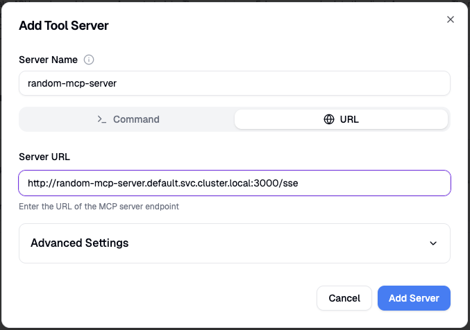
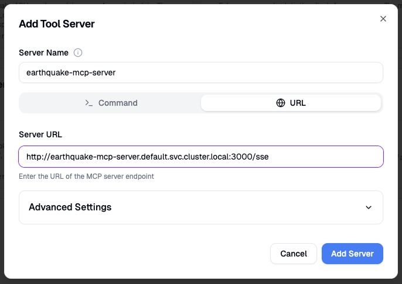
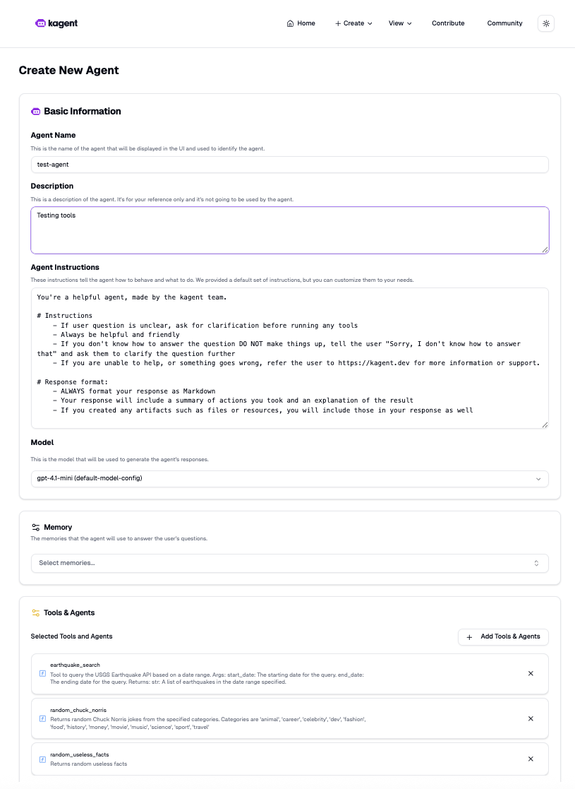
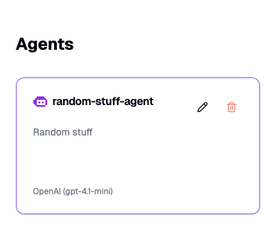
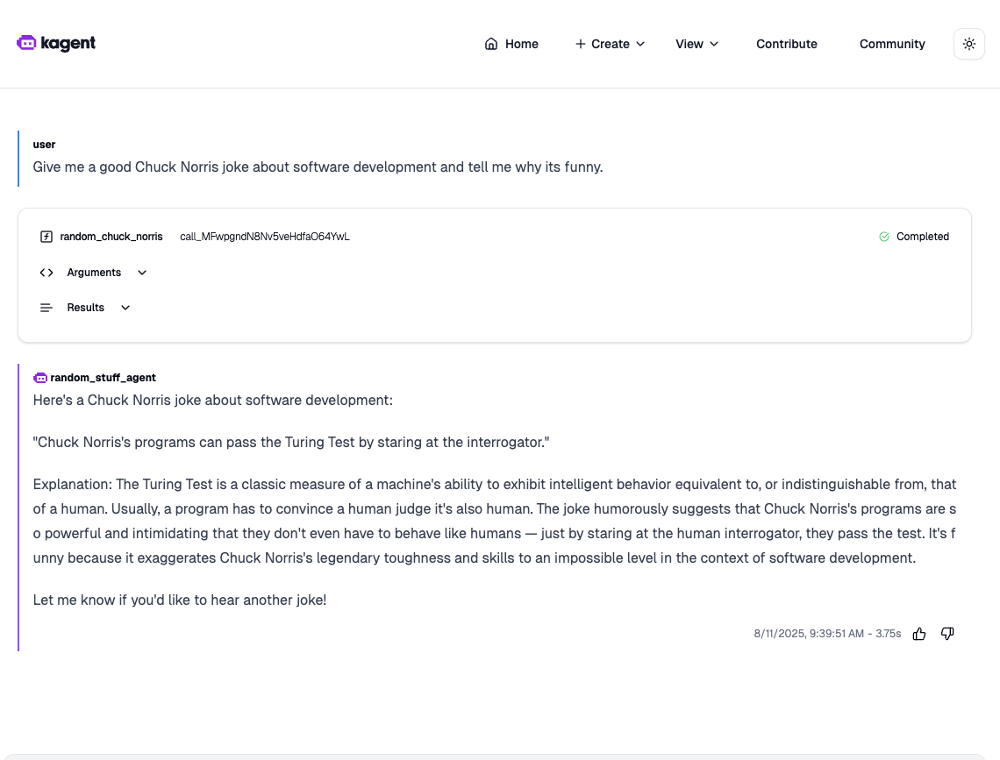

# kmcp + kagent

# Environment Variables

Set some environment variables:

```bash
export DOCKER_NAMESPACE=btjimerson # Docker hub or equivalent
export EARTHQUAKE_MCP_SERVER_REPO_NAME=earthquake-mcp-server
export EARTHQUAKE_MCP_SERVER_REPO_TAG=0.1.0
export RANDOM_MCP_SERVER_REPO_NAME=random-mcp-server
export RANDOM_MCP_SERVER_REPO_TAG=0.1.0
export EARTHQUAKE_MCP_SERVER_IMAGE=$DOCKER_NAMESPACE/$EARTHQUAKE_MCP_SERVER_REPO_NAME:$EARTHQUAKE_MCP_SERVER_REPO_TAG
export RANDOM_MCP_SERVER_IMAGE=$DOCKER_NAMESPACE/$RANDOM_MCP_SERVER_REPO_NAME:$RANDOM_MCP_SERVER_REPO_TAG

export OPENAI_API_KEY=# OpenAI API Key
```

# Python MCP Server

## Create the MCP project

Initialize the MCP server:

```bash
kmcp init python earthquake-mcp-server
```

Add the `earthquake_search` tool:

```bash
kmcp add-tool earthquake_search --project-dir earthquake-mcp-server
```

## Implement the Earthquake MCP tool

Add the following to `kmcp.yaml`:

```yaml
tools:
  earthquake_search:
    name: earthquake_search
    usgs_base_url: https://earthquake.usgs.gov/fdsnws/event/1
    usgs_format: geojson
```

Edit `tools/earthquake_search.py` and adjust the contents:

```python
"""Earthquake_search tool for MCP server.
"""

import datetime
import requests
import json
import anyio
from core.server import mcp
from core.utils import get_tool_config

@mcp.tool()
async def earthquake_search(start_date: datetime.date, end_date: datetime.date ) -> str:
    """Tool to query the USGS Earthquake API based on a date range.

    Args:
        start_date: The starting date for the query.
        end_date: The ending date for the query.

    Returns:
        str: A list of earthquakes in the date range specified.
    """
    
    # Run query asynchronously; large date ranges can take a while to return
    return await anyio.to_thread.run_sync(query_usgs_api, start_date, end_date) # type: ignore

def query_usgs_api(start_date: datetime.date, end_date: datetime.date ) -> str:
    # Queries the USGS earthquake API

    # Get tool-specific configuration from kmcp.yaml
    config = get_tool_config("earthquake_search")
    base_url = config.get("usgs_base_url")
    format = config.get("usgs_format", "geojson")

    # Run the query
    query_url = f"{base_url}/query?format={format}&starttime={start_date}&endtime={end_date}"
    response = requests.get(query_url)

    # Return formatted json
    return json.dumps(response.json(), indent=4)

```

## Testing

Run the server locally:

```bash
kmcp run --project-dir earthquake-mcp-server
```

# Go MCP Server

## Create the MCP project

Initialize the MCP server:

```yaml
kmcp init go random-mcp-server
```

Add the `random_useless_facts` tool:

```yaml
kmcp add-tool random_useless_facts --project-dir random-mcp-server
```

Add the `random_chuck_norris` tool:

```yaml
kmcp add-tool random_chuck_norris --project-dir random-mcp-server
```

## Implement the Useless Facts MCP tool

 Edit `tools/random_useless_facts.go` and change the contents to this:

```go
package tools

import (
	"context"
	"encoding/json"
	"log"
	"net/http"

	"github.com/modelcontextprotocol/go-sdk/mcp"
)

func init() {
	registerTool(MCPTool[RandomUselessFactsToolParams, RandomUselessFactsToolResult]{
		Name:        "random_useless_facts",
		Description: "Returns random useless facts",
		Handler: func(ctx context.Context, cc *mcp.ServerSession, params *mcp.CallToolParamsFor[RandomUselessFactsToolParams]) (*mcp.CallToolResultFor[RandomUselessFactsToolResult], error) {
			result := runRandomUselessFactsTool()
			return &mcp.CallToolResultFor[RandomUselessFactsToolResult]{
				StructuredContent: RandomUselessFactsToolResult{
					ID:        result.ID,
					Text:      result.Text,
					Source:    result.Source,
					SourceURL: result.SourceURL,
					Language:  result.Language,
					Permalink: result.Permalink,
				},
				Content: []mcp.Content{
					&mcp.TextContent{
						Text: result.Text,
					},
				},
			}, nil
		},
	})
}

// Empty input schema
type RandomUselessFactsToolParams struct{}

// Output schema
type RandomUselessFactsToolResult struct {
	ID        string `json:"id"`
	Text      string `json:"text"`
	Source    string `json:"source"`
	SourceURL string `json:"source_url"`
	Language  string `json:"language"`
	Permalink string `json:"permalink"`
}

// Queries the random useless facts API
func runRandomUselessFactsTool() RandomUselessFactsToolResult {
	// API endpoint
	uselessFactsUrl := "https://uselessfacts.jsph.pl/api/v2/facts/random"

	// Make a GET request to the API
	resp, err := http.Get(uselessFactsUrl)
	if err != nil {
		log.Printf("Error calling useless facts API: %s", err)
	}

	defer resp.Body.Close()

	// Parse the JSON response
	var uselessFact RandomUselessFactsToolResult
	if err := json.NewDecoder(resp.Body).Decode(&uselessFact); err != nil {
		log.Printf("Error decoding JSON: %s", err)
	}

	return uselessFact
}
```

## Implement the Chuck Norris MCP Tool

Edit `tools/random_chuck_norris.go` and change the contents to this:

```go
package tools

import (
	"context"
	"encoding/json"
	"fmt"
	"log"
	"net/http"

	"github.com/modelcontextprotocol/go-sdk/mcp"
)

// Category type for jokes
type Category string

// List of allowed categories; we don't want any questionable jokes
const (
	CategoryAnimal    Category = "animal"
	CategoryCareer    Category = "career"
	CategoryCelebrity Category = "celebrity"
	CategoryDev       Category = "dev"
	CategoryFashion   Category = "fashion"
	CategoryFood      Category = "food"
	CategoryHistory   Category = "history"
	CategoryMoney     Category = "money"
	CategoryMovie     Category = "movie"
	CategoryMusic     Category = "music"
	CategoryScience   Category = "science"
	CategorySport     Category = "sport"
	CategoryTravel    Category = "travel"
)

func init() {
	registerTool(MCPTool[RandomChuckNorrisToolParams, RandomChuckNorrisToolResult]{
		Name:        "random_chuck_norris",
		Description: "Returns random Chuck Norris jokes from the specified categories. Categories are 'animal', 'career', 'celebrity', 'dev', 'fashion', 'food', 'history', 'money', 'movie', 'music', 'science', 'sport', 'travel'",
		Handler: func(ctx context.Context, cc *mcp.ServerSession, params *mcp.CallToolParamsFor[RandomChuckNorrisToolParams]) (*mcp.CallToolResultFor[RandomChuckNorrisToolResult], error) {
			result := runRandomChuckNorrisTool(params.Arguments.Category)
			return &mcp.CallToolResultFor[RandomChuckNorrisToolResult]{
				StructuredContent: RandomChuckNorrisToolResult{
					ID:         result.ID,
					Categories: result.Categories,
					IconURL:    result.IconURL,
					URL:        result.URL,
					Value:      result.Value,
				},
				Content: []mcp.Content{
					&mcp.TextContent{
						Text: result.Value,
					},
				},
			}, nil
		},
	})
}

// Input schema
type RandomChuckNorrisToolParams struct {
	Category Category `json:"category"`
}

// Output schema
type RandomChuckNorrisToolResult struct {
	Categories []any  `json:"categories"`
	IconURL    string `json:"icon_url"`
	ID         string `json:"id"`
	URL        string `json:"url"`
	Value      string `json:"value"`
}

// Queries the random chuck norris API
func runRandomChuckNorrisTool(category Category) RandomChuckNorrisToolResult {
	// API endpoint
	chuckNorrisUrl := fmt.Sprintf("https://api.chucknorris.io/jokes/random?category=%s", category)

	// Make a GET request to the API
	resp, err := http.Get(chuckNorrisUrl)
	if err != nil {
		log.Printf("Error calling Chuck Norris API: %s", err)
	}

	defer resp.Body.Close()

	// Parse the JSON response
	var chuckNorrisJoke RandomChuckNorrisToolResult
	if err := json.NewDecoder(resp.Body).Decode(&chuckNorrisJoke); err != nil {
		log.Printf("Error decoding JSON: %s", err)
	}

	return chuckNorrisJoke
}

```

## Testing

Run the server locally:

```bash
kmcp run --project-dir random-mcp-server
```

# Deploy to Kubernetes

## Install Controller

Install the KCMP controller in a Kubernetes cluster:

```bash
kmcp install --version 0.1.2
```

Verify the controller manager is deployed:

```bash
kubectl get pods -n kmcp-system
```

## Deploy the MCP servers

Build the earthquake MCP server:

```bash
kmcp build --project-dir earthquake-mcp-server --push --tag $EARTHQUAKE_MCP_SERVER_IMAGE
```

Deploy the earthquake MCP server to Kubernetes

```bash
kmcp deploy --file earthquake-mcp-server/kmcp.yaml --image $EARTHQUAKE_MCP_SERVER_IMAGE --no-inspector
```

Build the random MCP server:

```bash
kmcp build --project-dir random-mcp-server --push --tag $RANDOM_MCP_SERVER_IMAGE
```

Deploy the random MCP server to Kubernetes

```bash
kmcp deploy --file random-mcp-server/kmcp.yaml --image $RANDOM_MCP_SERVER_IMAGE  --no-inspector
```

Port forward the earthquake MCP server:

```bash
kubectl port-forward deployment/earthquake-mcp-server 3000
```

Launch the MCP Inspector to test:

```bash
npx @modelcontextprotocol/inspector
```

Stop the port forward to the earthquake MCP server (`CTRL+C` ), and port forward the random MCP server:

```bash
kubectl port-forward deployment/random-mcp-server 3000
```

Launch the MCP Inspector to test:

```bash
npx @modelcontextprotocol/inspector
```

# kagent

Install kagent in the Kubernetes cluster:

```bash
kagent install
```

Launch the kagent dashboard:

```bash
kagent dashboard
```

Create a new tool server for `random-mcp-server`:

Create → New Tool Server → Add Server

Name: random-mcp-server

URL: `http://random-mcp-server.default.svc.cluster.local:3000/sse`



Create another tool server for `earthquake-mcp-server` :

Create → New Tool Server → Add Server

Name: earthquake-mcp-server

URL: `http://earthquake-mcp-server.default.svc.cluster.local:3000/sse`



Create an agent for the tools:

Create → New Agent

Agent Name: test-agent

Description: Testing tools

Add Tools & Agents → Select `random_chuck_norris`, `random_useless_facts`, and `earthquake_search`



Select the `test-agent` and ask it to give you a Chuck Norris joke!



